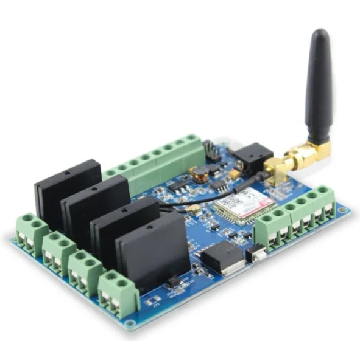

# SMS Relay Control via Elecrow Leonardo GSM/GPRS Module

Control up to **4 relays** via **SMS commands** using the [Elecrow Leonardo GPRS/GSM IoT Board](https://www.elecrow.com/leonardo-gprs-gsm-iot-board.html). This project is perfect for **IoT**, **remote automation**, and **home/industrial control** systems.

📲 **Send an SMS** like `R1O` to turn on relay 1, or `R1C` to turn it off — with instant feedback and acknowledgment messages sent back to your phone.

---

## 📦 Features

- ✅ **SMS-based Relay Control** (Open/Close Relays 1–4)
- ✅ **SMS Acknowledgement Reply** to Sender
- ✅ Plug-and-play for **SIM800C-based GSM modules**
- ✅ Designed for the **Elecrow Leonardo GSM/GPRS board**
- ✅ Fully written in **C++ (Arduino IDE)** — no Arduino libraries needed
- ✅ Easily portable to **Microchip Studio / Atmel Studio**
- ✅ Includes modem reset and auto-configuration
- ✅ Customizable commands, message formats, and response texts

---

## 💬 Example SMS Commands

| SMS Command | Description       |
|-------------|-------------------|
| `R1O`       | Open Relay 1      |
| `R1C`       | Close Relay 1     |
| `R2O`       | Open Relay 2      |
| `R2C`       | Close Relay 2     |
| `R3O`       | Open Relay 3      |
| `R3C`       | Close Relay 3     |
| `R4O`       | Open Relay 4      |
| `R4C`       | Close Relay 4     |

🛎️ **Acknowledgment SMS** is sent automatically after every valid command.

---

## 🛠 Hardware Requirements

- ✅ [Elecrow Leonardo GSM/GPRS Board (SIM800C)](https://www.elecrow.com/leonardo-gprs-gsm-iot-board.html)
- ✅ Active SIM card with SMS capability
- ✅ 4-channel relay module
- ✅ External 12V/5V power supply for relays (as required)

---

## ⚙️ Setup Instructions

1. Insert a SIM card into the GSM module
2. Wire relay module to pins **2, 3, 4, 5**
3. Connect board to PC via USB
4. Upload code using **Arduino IDE** or **Microchip Studio**
5. Open Serial Monitor @ `19200 baud` for debug messages
6. Send SMS from your mobile: `R1O`, `R2C`, etc.

---

## 📂 File Structure
📁 /sms-relay-controller
├── sms-relay-controller.ino # Main Arduino code
├── README.md # This file

---

## 🔧 Customization Services

📨 **Need a tailored solution for your project or product?**

I offer affordable and professional code customization for:

- ✅ Custom SMS commands or password protection
- ✅ Multi-relay control, schedules, or sensors
- ✅ Industrial IoT automation
- ✅ Support for alternative GSM modules (SIM800L, A6, A9, etc.)
- ✅ Conversion to C for Microchip Studio / bare-metal AVR

> **📧 Email:** [thilanga@blis4.co.nz](mailto:thilanga@blis4.co.nz)  
> **🌐 Website:** Coming soon (Blis4 Technologies Ltd.)

---

## 📈 SEO Keywords

> *Elecrow GSM Arduino*, *SIM800C SMS relay controller*, *Arduino relay control via SMS*, *Leonardo GPRS SMS automation*, *Elecrow IoT GSM custom code*, *Arduino Elecrow GSM C code*, *AVR SIM800 SMS example*, *Elecrow GPRS SMS relay automation*, *custom Elecrow firmware development*

---

## 📜 License

This code is released under the [MIT License](LICENSE).

---

## 🙌 Credits

Originally adapted from Elecrow Keen  
Customized and maintained by **Thilanga Ariyarathna**, Blis4 Technologies Ltd.

